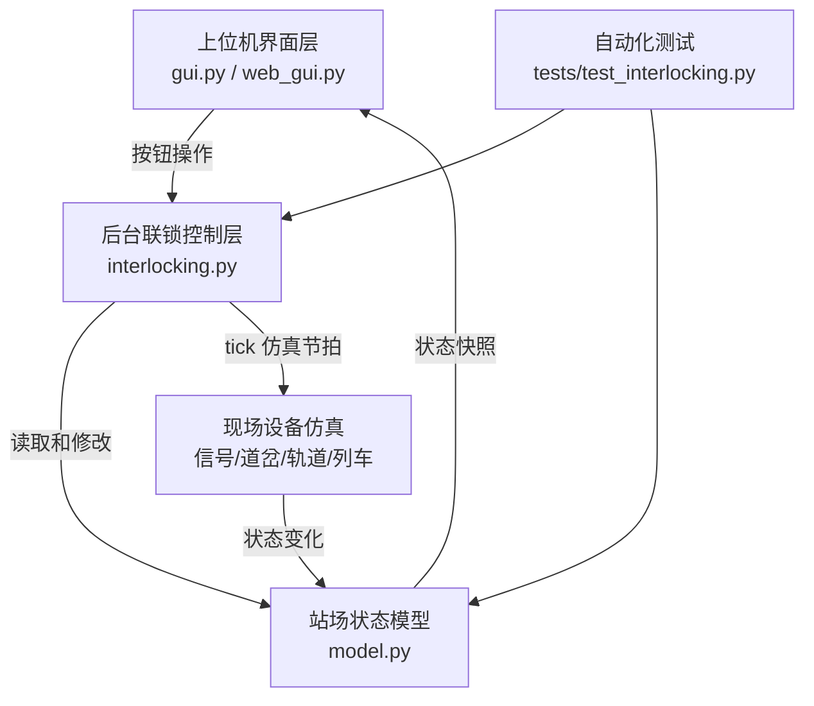
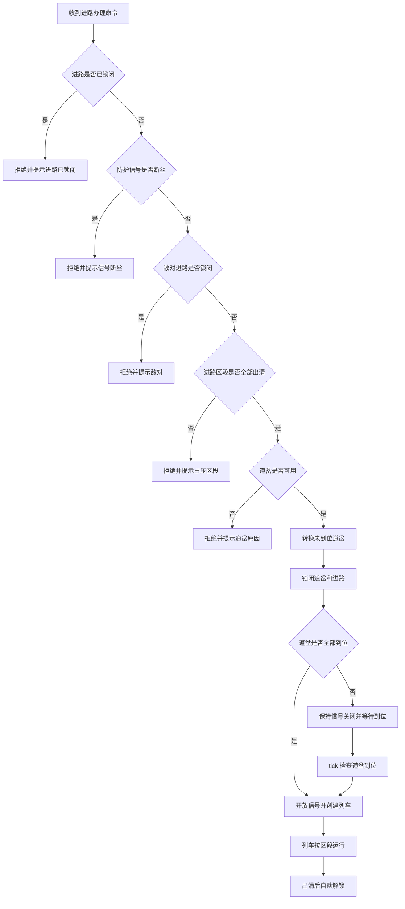
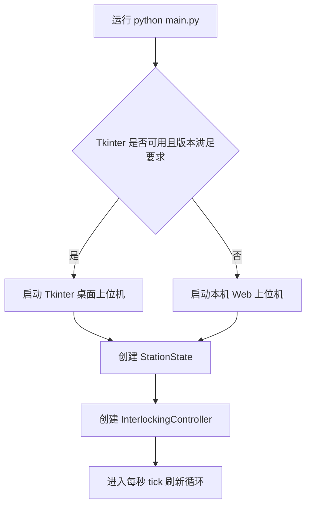

# 计算机联锁模拟仿真系统完整设计方案

## 摘要

本系统采用纯软件方式实现计算机联锁模拟仿真，将上位机操作平台、后台联锁逻辑软件、现场设备状态仿真和测试验证环境集成在一台计算机中。系统面向课程作业要求，完整覆盖站场设备图形显示、列车与调车作业办理、道岔单操及锁闭、进路取消与人工解锁、信号设备状态仿真、道岔动作仿真、轨道电路占压与出清仿真等功能。

系统使用 Python 3.10+ 开发，桌面端界面基于 Tkinter 标准库实现；当运行环境缺少可用 Tk 组件时，程序自动切换到本机浏览器承载界面。后台联锁逻辑使用统一的站场状态模型驱动，界面只负责操作输入和状态显示，联锁安全检查、进路锁闭、信号开放、列车运行、倒计时解锁均由后台控制器集中完成，从而保证图形显示与联锁逻辑一致。

## 1. 项目背景与设计目标

### 1.1 项目背景

计算机联锁系统是铁路车站行车组织中的核心安全系统，其主要功能是在办理列车、调车进路时检查轨道区段、道岔、信号、敌对进路等条件，确保进路建立、信号开放和设备动作符合安全约束。本课程作业要求通过纯软件方式，在一台计算机上模拟计算机联锁系统的主要功能，并形成完整设计方案及可运行模拟软件环境。

本项目依据作业要求进行设计与实现，重点不是复刻真实工程系统的全部复杂细节，而是在可演示、可测试、可解释的范围内模拟计算机联锁的主要流程和安全逻辑，使上位机图形、后台联锁、现场设备仿真三部分形成闭环。

### 1.2 设计目标

系统设计目标如下：

1. 实现一套可运行的计算机联锁模拟软件，支持在单机环境中完成演示。
2. 建立清晰的站场设备模型，包含信号机、道岔、轨道电路、进路和列车对象。
3. 实现列车接车、发车、通过作业和站内调车作业的完整办理流程。
4. 实现进路锁闭、取消、人工解锁、自动解锁等联锁主要逻辑。
5. 实现道岔定操、反操、单锁、单解、封锁、解封等操作逻辑。
6. 实现信号开放/关闭/断丝、道岔定位/反位/转换中、轨道占压/出清等现场设备仿真。
7. 提供自动化测试和人工演示流程，便于验收和答辩。

## 2. 需求分析

### 2.1 作业需求分解

作业要求由三大部分组成：计算机联锁上位机功能、后台运算逻辑联锁软件、现场设备仿真功能。系统按照评分点逐项分解如下。

| 需求类别 | 子功能 | 分值 | 本系统实现方式 |
|---|---:|---:|---|
| 上位机功能 | 站场设备图形完整显示 | 10% | Tkinter Canvas 绘制站场图，包含股道、道岔、信号机、终端点、安全线和轨道区段 |
| 上位机功能 | 办理列车按钮下发作业 | 5% | 列车作业按钮调用后台 `request_route()` 办理接车、发车、通过进路 |
| 上位机功能 | 办理调车按钮作业 | 5% | 调车作业按钮调用后台办理 D1、D2、安全线调车进路 |
| 上位机功能 | 办理单独操作道岔按钮下发 | 5% | 每个道岔提供定操、反操、单锁、单解、封锁、解封按钮 |
| 上位机功能 | 站场设备动态显示 | 10% | 使用颜色和文字标识轨道、信号、道岔、列车状态 |
| 上位机功能 | 倒计时、操作提示等辅助功能 | 5% | 状态区显示仿真秒、当前进路、倒计时、设备状态和最近操作提示 |
| 后台联锁逻辑 | 列车接车、发车及通过作业完整过程 | 10% | 进路表、条件检查、道岔转换、信号开放、列车运行、出清解锁 |
| 后台联锁逻辑 | 站内调车作业完整过程 | 10% | 调车进路同样执行安全检查、锁闭、防护和解锁 |
| 后台联锁逻辑 | 取消进路功能含人工解锁 | 10% | 空闲进路普通取消 2 秒解锁，占用进路人工解锁 5 秒释放 |
| 后台联锁逻辑 | 道岔单操、单锁及封锁逻辑 | 10% | 单操检查进路锁闭、单锁、封锁、岔区占压 |
| 后台联锁逻辑 | 进路解锁功能 | 10% | 列车完整出清自动解锁，手动自动解锁按轨道出清条件执行 |
| 仿真功能 | 室外信号设备开放、关闭、断丝状态仿真 | 4% | `SignalAspect` 三态模型和界面颜色显示 |
| 仿真功能 | 室外道岔设备动作、位置状态仿真 | 4% | `SwitchPosition` 三态模型，2 个节拍完成转换 |
| 仿真功能 | 室外轨道电路车列占压、出清状态仿真 | 2% | `TrackState` 出清/占压状态，列车逐段移动 |

### 2.2 功能性需求

系统功能性需求包括：

1. 用户能够通过图形界面查看完整站场设备。
2. 用户能够点击按钮办理列车接车、发车和通过作业。
3. 用户能够点击按钮办理站内调车作业。
4. 用户能够对 1、2、3、4、5 号道岔进行单独操作。
5. 系统能够根据联锁条件拒绝不安全操作，并给出明确提示。
6. 系统能够显示进路锁闭、信号开放、轨道占压、道岔转换等动态状态。
7. 系统能够完成普通取消、人工解锁和自动解锁。
8. 系统能够模拟信号断丝、轨道占压/出清等故障或现场状态。
9. 系统能够通过自动化测试验证核心逻辑。

### 2.3 非功能性需求

系统非功能性需求如下：

| 项目 | 要求 |
|---|---|
| 运行环境 | Python 3.10+，优先使用标准库，减少外部依赖 |
| 可演示性 | 操作流程直观，按钮、颜色、提示与业务含义对应 |
| 可维护性 | 数据模型、联锁控制、图形界面分模块设计 |
| 可测试性 | 后台逻辑可脱离界面进行单元测试 |
| 容错性 | Tk 不可用时自动切换到本机浏览器承载界面 |
| 安全逻辑一致性 | 信号开放、道岔锁闭、轨道占压等状态由后台统一控制 |

## 3. 总体设计

### 3.1 系统架构

系统采用三层结构：上位机界面层、后台联锁逻辑层、站场状态与现场仿真层。



各层职责如下：

| 层次 | 主要文件 | 职责 |
|---|---|---|
| 上位机界面层 | `interlocking_sim/gui.py`、`interlocking_sim/web_gui.py` | 绘制站场图、提供按钮、刷新状态、显示提示 |
| 后台联锁控制层 | `interlocking_sim/interlocking.py` | 执行进路办理、冲突检查、道岔控制、信号控制、解锁控制 |
| 数据模型层 | `interlocking_sim/model.py` | 定义信号、道岔、轨道、进路、列车、站场状态 |
| 启动入口 | `main.py` | 检测 Tk 环境并选择桌面或浏览器界面 |
| 测试层 | `tests/test_interlocking.py` | 验证联锁逻辑、异常处理和 Web 接口参数检查 |

### 3.2 设计原则

系统遵循以下设计原则：

1. **状态集中原则**：所有设备状态保存在 `StationState` 中，界面只读取状态并显示，避免界面状态与后台状态不一致。
2. **联锁优先原则**：所有涉及安全的操作必须通过 `InterlockingController` 执行，不能由界面直接改变关键联锁状态。
3. **先检查后动作原则**：办理进路时先检查信号、敌对进路、轨道、道岔等条件，全部满足后才执行转换和锁闭。
4. **道岔到位后开放信号原则**：若进路需要道岔转换，系统先锁闭进路并等待道岔到位，确认位置满足要求后再开放防护信号。
5. **仿真节拍统一原则**：道岔转换、倒计时、列车移动均由 `tick()` 统一驱动，便于演示和测试。

## 4. 站场与设备模型设计

### 4.1 站场总体布局

本系统站场抽象为左端接车方向、三条到发线、右端出站方向和一条安全线。站场逻辑示意如下：

```text
JXG -- IIAG -- 1 -- 3 ---------------------- 4 -- 2 -- IIBG -- JSG
                 \  3G ------------------- /      /
                  \ IIG ------------------/------/
                   \ 1G ------------------------/
安全线 -- PZA -- 5 -- 1G
```

站场中的主要设备包括：

| 类型 | 设备名称 | 说明 |
|---|---|---|
| 股道 | 3G、IIG、1G | 三条主要到发线 |
| 区间/咽喉 | JXG、IIAG、右咽喉、IIBG、JSG | 左右端接发车通路 |
| 道岔 | 1、2、3、4、5 | 用于连接不同股道和安全线 |
| 信号机 | X、D1、S3、SII、S1、X3、XII、X1、D2、S | 进站、出站、调车及股道方向信号 |
| 终端点 | PZA | 安全线附近终端点 |
| 轨道电路 | 多个细分区段 | 用于模拟列车占压和出清 |

### 4.2 轨道电路细分

为了实现动态占压效果，后台将显示上的股道进一步细分为多个轨道电路区段。

| 线路区域 | 后台轨道电路区段 |
|---|---|
| 左端接近与左咽喉 | JXG、IIAG-A、IIAG-B |
| 3G 股道 | 3G-L、3G-M、3G-R |
| IIG 股道 | IIG-L、IIG-M、IIG-R |
| 1G 股道 | 1G-L、1G-M、1G-R、1G-RT |
| 右端咽喉与出站 | 右咽喉、IIBG-A、IIBG-B、JSG |
| 安全线 | 安全线-A、安全线-B |

细分区段的作用是：

1. 办理进路前能够逐段检查占压。
2. 列车运行时能够显示红色占压沿区段逐段移动。
3. 出清后能够按区段恢复显示，使动态效果更接近实际轨道电路。

### 4.3 设备状态模型

系统使用枚举和数据类表示设备状态。

| 模型 | 主要字段 | 含义 |
|---|---|---|
| `SwitchPosition` | `NORMAL`、`REVERSE`、`MOVING` | 道岔定位、反位、转换中 |
| `SignalAspect` | `RED`、`GREEN`、`BROKEN` | 信号关闭、开放、断丝 |
| `TrackState` | `CLEAR`、`OCCUPIED` | 轨道出清、占压 |
| `Switch` | `position`、`target`、`locked`、`single_locked`、`blocked` | 道岔位置、目标位置、进路锁闭、单锁、封锁 |
| `Signal` | `aspect`、`broken` | 信号显示和断丝状态 |
| `TrackCircuit` | `state` | 轨道电路占用状态 |
| `Route` | `tracks`、`switches`、`conflicting_routes`、`locked` | 进路包含区段、所需道岔位置、敌对进路、锁闭状态 |
| `Train` | `segments`、`index`、`active` | 列车运行区段序列、当前位置、是否运行 |
| `StationState` | `switches`、`signals`、`tracks`、`routes`、`trains` | 全站统一状态 |

## 5. 上位机功能设计

### 5.1 界面组成

桌面版上位机采用 Tkinter 实现，主窗口尺寸为 1280 x 880。界面由站场图、按钮区和状态提示区组成。

| 区域 | 内容 | 功能 |
|---|---|---|
| 站场图区域 | Canvas 绘制轨道、道岔、信号机、终端点、列车 | 直观显示站场设备及动态状态 |
| 列车作业按钮区 | 接车至 3G/IIG/1G、3G/IIG/1G 发车、通过作业 | 下发列车进路办理命令 |
| 调车作业按钮区 | D1 至 1G 调车、D2 至 IIG 调车、安全线调车 | 下发调车进路办理命令 |
| 进路控制区 | 取消当前进路、人工解锁、自动解锁、清除所有进路 | 实现进路解锁相关操作 |
| 道岔操作区 | 每个道岔的定操、反操、单锁、单解、封锁、解封 | 实现道岔单独操作 |
| 仿真控制区 | 模拟列车进入/出清、轨道占用/出清、信号断丝/恢复、重置 | 实现现场设备仿真和异常演示 |
| 状态提示区 | 仿真秒、当前进路、进路状态、道岔状态、轨道状态、操作提示 | 显示后台状态和拒绝原因 |

### 5.2 图形显示规则

站场图使用颜色和文字显示设备状态。

| 对象 | 状态 | 显示方式 |
|---|---|---|
| 轨道电路 | 出清 | 棕色 |
| 轨道电路 | 进路锁闭 | 蓝色 |
| 轨道电路 | 车列占压 | 红色 |
| 信号机 | 关闭 | 灰色灯 |
| 信号机 | 开放 | 绿色灯 |
| 信号机 | 断丝 | 橙色灯，并显示“断丝” |
| 道岔 | 定位 | 紫色方块，标记 N |
| 道岔 | 反位 | 粉色方块，标记 R |
| 道岔 | 转换中 | 黄色方块，标记 T |
| 道岔 | 进路锁闭/单锁/封锁 | 通过边框颜色和状态区文字显示 |
| 列车 | 运行中 | 蓝色车体，标注 T1、T2 等编号 |

### 5.3 上位机与后台交互

上位机界面不直接修改关键联锁状态，而是调用后台控制器接口：

| 用户操作 | 调用接口 | 后台处理 |
|---|---|---|
| 点击列车/调车进路按钮 | `request_route(route_name)` | 执行安全检查、转换道岔、锁闭进路、开放信号、创建列车 |
| 点击取消当前进路 | `cancel_route()` | 空闲进路进入 2 秒正常解锁倒计时 |
| 点击人工解锁 | `cancel_route(manual=True)` | 进入 5 秒人工解锁倒计时 |
| 点击自动解锁 | `auto_unlock()` | 检查轨道出清后释放进路 |
| 点击定操/反操 | `move_switch(name, target)` | 检查道岔状态和岔区占压后转换 |
| 点击单锁/单解 | `set_switch_lock()` | 设置或解除单锁 |
| 点击封锁/解封 | `set_switch_block()` | 设置或解除封锁 |
| 点击信号断丝/恢复 | `set_signal_broken()` | 设置或恢复信号故障状态 |
| 点击轨道占用/出清 | `set_track_occupied()` | 模拟现场轨道状态变化 |

### 5.4 浏览器备用界面

考虑到不同系统环境中 Tkinter 可能不可用，`main.py` 在启动时检测 Tk 环境。如果 Tk 不可用或版本过低，则自动切换到 `web_gui.py`，在本机启动 `http://127.0.0.1:8765`。浏览器界面仍运行在本机，不依赖互联网服务，并通过 HTTP 接口调用同一套后台联锁控制逻辑。

备用界面设计目的如下：

1. 保证没有 Tk 环境时仍可演示软件功能。
2. 保持与桌面版一致的站场状态模型。
3. 提供列车/调车进路、道岔操作、信号故障、轨道占压等核心按钮。
4. 对错误参数返回明确提示，避免页面操作异常导致程序崩溃。

## 6. 后台联锁逻辑设计

### 6.1 进路表设计

后台在 `build_station()` 中定义列车和调车进路。每条进路包含进路名称、作业类型、防护信号、轨道区段序列、所需道岔位置和敌对进路列表。

| 进路名称 | 类型 | 防护信号 | 主要轨道区段 | 道岔条件 |
|---|---|---|---|---|
| X至3G接车 | 列车 | X | JXG、IIAG-A、IIAG-B、3G-L、3G-M、3G-R | 1 反位、4 反位 |
| X至IIG接车 | 列车 | X | JXG、IIAG-A、IIAG-B、IIG-L、IIG-M、IIG-R | 1 定位、3 定位、4 定位 |
| X至1G接车 | 列车 | X | JXG、IIAG-A、IIAG-B、1G-L、1G-M、1G-R、1G-RT | 3 反位、2 反位 |
| 3G至S发车 | 列车 | S3 | 3G-M、3G-R、右咽喉、IIBG-A、IIBG-B、JSG | 4 反位、2 定位 |
| IIG至S发车 | 列车 | SII | IIG-M、IIG-R、右咽喉、IIBG-A、IIBG-B、JSG | 4 定位、2 定位 |
| 1G至S发车 | 列车 | S1 | 1G-M、1G-R、1G-RT、IIBG-A、IIBG-B、JSG | 2 反位 |
| X至S通过 | 列车 | X | JXG、IIAG-A、IIAG-B、IIG-L、IIG-M、IIG-R、右咽喉、IIBG-A、IIBG-B、JSG | 1 定位、3 定位、4 定位、2 定位 |
| D1至1G调车 | 调车 | D1 | IIAG-B、1G-L、1G-M | 3 反位 |
| D2至IIG调车 | 调车 | D2 | IIBG-A、右咽喉、IIG-R、IIG-M | 2 定位、4 定位 |
| 安全线调车 | 调车 | PZA | 安全线-A、安全线-B、1G-M | 5 反位 |

敌对进路由系统根据轨道区段、道岔资源和防护信号自动计算。若两条进路共享轨道区段、共享道岔或使用相同防护信号，则互为敌对。

### 6.2 进路办理流程

进路办理由 `request_route()` 完成。总体流程如下：



安全检查顺序为：

1. 检查进路是否已锁闭。
2. 检查防护信号是否断丝。
3. 检查敌对进路是否锁闭。
4. 检查进路内所有轨道电路是否出清。
5. 检查所需道岔是否封锁。
6. 检查道岔是否单锁且位置不符。
7. 检查道岔是否已被其他进路锁闭。
8. 执行道岔转换、进路锁闭、信号开放和列车仿真。

### 6.3 道岔到位与信号开放逻辑

系统采用“先锁闭、后到位、再开放”的逻辑：

1. 若进路所需道岔已经在要求位置，则进路锁闭后立即开放防护信号。
2. 若进路所需道岔不在要求位置，则道岔进入转换中，进路先锁闭，防护信号保持关闭。
3. `tick()` 每秒检查道岔转换状态，待全部道岔到达要求位置后，才开放防护信号并创建列车。

以“接车至 3G”为例，系统要求 1 号道岔反位、4 号道岔反位。点击按钮后，1、4 号道岔先显示转换中，进路区段显示锁闭；待道岔到反位后，X 信号机开放，列车开始运行。

### 6.4 调车作业逻辑

调车作业与列车作业使用同一套进路办理框架，区别在于进路类型为“调车”，防护信号可为 D1、D2 或 PZA 终端点。调车进路同样执行敌对检查、轨道占压检查、道岔状态检查、进路锁闭、信号或终端防护、车列运行和出清解锁。

系统支持的调车作业包括：

1. D1 至 1G 调车。
2. D2 至 IIG 调车。
3. 安全线调车。

### 6.5 取消进路与人工解锁

系统支持普通取消和人工解锁两种方式。

| 类型 | 使用条件 | 倒计时 | 处理结果 |
|---|---|---:|---|
| 普通取消 | 进路已锁闭且未被列车占用 | 2 秒 | 信号关闭，倒计时结束后释放进路和道岔 |
| 人工解锁 | 进路占用或需要非正常处理 | 5 秒 | 信号关闭，倒计时结束后强制释放进路和道岔 |
| 自动解锁 | 进路内所有轨道区段均出清 | 无固定等待 | 检查通过后立即释放进路 |

若进路存在轨道占压，普通取消会被拒绝，并提示“进路占用，需人工解锁”。人工解锁启动后，系统关闭信号并倒计时，倒计时结束后释放进路。

### 6.6 道岔单操、单锁与封锁逻辑

道岔单独操作由 `move_switch()` 执行。系统在道岔转换前进行以下检查：

1. 道岔是否被进路锁闭。
2. 道岔是否处于单锁状态。
3. 道岔是否处于封锁状态。
4. 道岔相关轨道区段是否占压。

只有全部条件满足时，道岔才能从定位转反位或从反位转定位。道岔转换过程不是瞬时完成，而是先进入“转换中”，经过 2 个仿真节拍后到达目标位置。

单锁和封锁的含义如下：

| 操作 | 含义 | 对后续操作的影响 |
|---|---|---|
| 单锁 | 人工锁住某一道岔当前位置 | 后续定操/反操被拒绝；若进路要求位置不符，也不能办理 |
| 单解 | 解除单锁 | 道岔恢复可单操状态，但仍受占压、封锁和进路锁闭限制 |
| 封锁 | 模拟设备故障或施工防护 | 单操和涉及该道岔的进路均被拒绝 |
| 解封 | 解除封锁 | 恢复该道岔参与进路办理和单操的资格 |

## 7. 现场设备仿真设计

### 7.1 信号设备仿真

信号机包含三种状态：关闭、开放、断丝。

| 状态 | 后台枚举 | 界面显示 | 说明 |
|---|---|---|---|
| 关闭 | `SignalAspect.RED` | 灰色 | 正常禁止显示 |
| 开放 | `SignalAspect.GREEN` | 绿色 | 进路建立且道岔到位后开放 |
| 断丝 | `SignalAspect.BROKEN` | 橙色并显示“断丝” | 故障状态，禁止建立需要开放该信号的进路 |

信号断丝由 `set_signal_broken()` 设置。若某信号机处于断丝状态，系统拒绝办理以该信号为防护信号的进路。

### 7.2 道岔设备仿真

道岔包含定位、反位、转换中三种位置状态。

| 状态 | 后台枚举 | 界面标记 | 说明 |
|---|---|---|---|
| 定位 | `SwitchPosition.NORMAL` | N | 道岔处于默认定位 |
| 反位 | `SwitchPosition.REVERSE` | R | 道岔处于反位 |
| 转换中 | `SwitchPosition.MOVING` | T | 道岔正在动作 |

当用户单操道岔或进路自动选排道岔时，若当前位置与目标位置不同，则道岔进入转换中，并设置 `move_ticks=2`。每次 `tick()` 将倒计数减一，倒计数结束后道岔到达目标位置。

### 7.3 轨道电路仿真

轨道电路包含出清和占压两种状态。

| 状态 | 后台枚举 | 界面颜色 | 说明 |
|---|---|---|---|
| 出清 | `TrackState.CLEAR` | 棕色 | 区段无车占用 |
| 占压 | `TrackState.OCCUPIED` | 红色 | 区段被列车或模拟操作占用 |

列车运行时，系统按进路的 `tracks` 序列逐段移动。列车进入新区段时，新区段置为占压；列车离开旧区段时，旧区段恢复出清。列车驶出最后一个区段后，进路自动释放。

## 8. 系统运行流程

### 8.1 启动流程



### 8.2 一次接车作业流程示例

以“X 至 3G 接车”为例，正确流程如下：

1. 用户点击“接车至 3G”按钮。
2. 后台检查 X 信号是否断丝、敌对进路是否锁闭、进路区段是否出清。
3. 后台检查 1 号、4 号道岔是否可用。
4. 若 1 号、4 号道岔不在反位，则先转换至反位。
5. 进路轨道显示蓝色锁闭，道岔显示锁闭状态。
6. 道岔到位后，X 信号开放为绿色。
7. 列车 T1 依次占压 JXG、IIAG-A、IIAG-B、3G-L、3G-M、3G-R。
8. 列车完全出清后，系统关闭 X 信号并释放进路和道岔锁闭。

### 8.3 一次异常拒绝流程示例

以“轨道占压后办理接车”为例：

1. 用户在仿真控制区选择 `3G-M`，点击模拟轨道占用。
2. 系统将 `3G-M` 置为占压并在图上显示红色。
3. 用户点击“接车至 3G”。
4. 后台检查发现 `3G-M` 占压。
5. 系统拒绝办理进路，并在提示区显示“3G-M占压”。

## 9. 软件模块设计

### 9.1 `model.py`

`model.py` 负责定义站场数据模型和初始化站场。

主要内容包括：

1. `SwitchPosition`、`SignalAspect`、`TrackState` 三个状态枚举。
2. `Switch`、`Signal`、`TrackCircuit`、`Train`、`Route`、`StationState` 数据类。
3. `build_station()` 函数，用于创建初始站场设备、轨道、信号、进路。
4. `_routes_conflict()` 函数，用于计算进路敌对关系。

### 9.2 `interlocking.py`

`interlocking.py` 负责联锁逻辑，是系统核心模块。

主要接口如下：

| 接口 | 功能 |
|---|---|
| `request_route(route_name, create_train=True)` | 办理列车或调车进路 |
| `cancel_route(route_name=None, manual=False)` | 取消进路或人工解锁 |
| `auto_unlock()` | 按轨道出清条件自动解锁当前进路 |
| `clear_all_routes()` | 清除所有锁闭进路 |
| `move_switch(switch_name, target)` | 单独转换道岔 |
| `set_switch_lock(switch_name, locked)` | 设置或解除道岔单锁 |
| `set_switch_block(switch_name, blocked)` | 设置或解除道岔封锁 |
| `set_signal_broken(signal_name, broken)` | 模拟信号断丝或恢复 |
| `set_track_occupied(track_name, occupied)` | 模拟轨道占用或出清 |
| `tick()` | 推进仿真节拍 |

### 9.3 `gui.py`

`gui.py` 负责桌面版上位机界面，主要功能包括：

1. 构建主窗口、站场图、按钮区和状态区。
2. 绘制轨道、信号机、道岔、列车、图例。
3. 根据后台状态刷新颜色和文字。
4. 将用户点击动作转换为后台控制器调用。

### 9.4 `web_gui.py`

`web_gui.py` 是备用本机浏览器界面，主要功能包括：

1. 启动 `ThreadingHTTPServer`。
2. 提供 `/state` 状态接口。
3. 提供 `/route`、`/switch`、`/signal`、`/track` 等控制接口。
4. 返回 HTML 页面并使用 JavaScript 绘制站场图。
5. 对缺失参数、非法参数、未知设备名和未知接口返回错误提示。

### 9.5 `main.py`

`main.py` 是系统启动入口，负责：

1. 设置基本运行环境。
2. 检测 Tk 是否可用。
3. 选择桌面界面或浏览器界面。
4. 输出备用界面切换原因。

## 10. 测试与验收设计

### 10.1 自动化测试

系统使用 Python 标准库 `unittest` 进行测试。当前测试覆盖 17 个用例，包括后台联锁逻辑和 Web 控制接口参数校验。

主要测试点如下：

| 测试类别 | 覆盖内容 |
|---|---|
| 进路办理测试 | 接车进路锁闭道岔、等待道岔到位后开放信号、列车进入区段 |
| 进路完整性测试 | 检查所有要求进路是否存在 |
| 敌对进路测试 | 已锁闭进路存在时拒绝办理敌对进路 |
| 道岔逻辑测试 | 单操、单锁、封锁及相关拒绝逻辑 |
| 信号故障测试 | 信号断丝时拒绝办理相关进路 |
| 轨道占压测试 | 轨道占压时拒绝办理相关进路 |
| 解锁测试 | 普通取消、人工解锁、自动解锁和列车出清自动释放 |
| 右咽喉道岔测试 | 检查 2 号道岔对 3G 发车和 D2 调车的限制 |
| Web 接口测试 | 缺少参数、非法布尔值、未知接口、未知信号名返回 400 |

测试命令：

```bash
python -m unittest discover -s tests
```

### 10.2 人工验收场景

人工验收可按以下顺序进行：

1. 启动软件，检查站场图设备是否完整。
2. 点击“接车至 3G”，观察 1、4 号道岔转反位，X 信号开放，列车逐段占压。
3. 在进路锁闭时尝试办理敌对进路，观察拒绝提示。
4. 等待列车出清，观察进路自动解锁、信号关闭。
5. 点击“D1 至 1G 调车”，观察调车进路办理和车列移动。
6. 单操 5 号道岔，观察转换中和到位状态。
7. 单锁 5 号道岔后再次单操，观察拒绝提示。
8. 封锁 5 号道岔后办理安全线调车，观察拒绝提示。
9. 模拟 X 信号断丝后办理 X 相关进路，观察拒绝提示。
10. 模拟轨道占用后办理相关进路，观察占压拒绝。

### 10.3 验收判据

系统满足以下条件即可认为达到设计目标：

1. 能够正常启动桌面界面或备用浏览器界面。
2. 站场图包含作业要求中的主要设备并能动态刷新。
3. 所有列车、调车进路均可按条件办理。
4. 敌对、占压、信号断丝、道岔锁闭、单锁、封锁等不安全条件能被拒绝。
5. 进路取消、人工解锁、自动解锁流程符合设计。
6. 信号、道岔、轨道电路三类现场设备仿真可演示。
7. 自动化测试全部通过。

## 11. 运行与部署说明

### 11.1 运行环境

| 项目 | 说明 |
|---|---|
| 操作系统 | Windows、macOS、Linux 均可运行 Python 版本 |
| Python | Python 3.10+ |
| 依赖 | 标准库 Tkinter、http.server、unittest 等 |
| 网络 | 不依赖互联网；浏览器界面仅使用本机地址 |

### 11.2 启动方式

在项目根目录执行：

```bash
python main.py
```

如果 Tkinter 可用，系统启动桌面窗口。如果 Tkinter 不可用，系统自动启动本机浏览器承载界面，访问地址为：

```text
http://127.0.0.1:8765
```

### 11.3 测试方式

在项目根目录执行：

```bash
python -m unittest discover -s tests
```

预期结果为所有测试通过。

## 12. 评分点对应说明

| 评分项 | 分值 | 对应设计与实现 |
|---|---:|---|
| 站场设备图形完整性显示 | 10% | `gui.py` 站场图绘制，包含股道、咽喉、道岔、信号机、安全线和 PZA |
| 办理列车按钮下发作业 | 5% | 列车作业按钮办理接车、发车、通过进路 |
| 办理调车按钮作业 | 5% | 调车按钮办理 D1、D2、安全线调车 |
| 办理单独操作道岔按钮下发 | 5% | 道岔 1 至 5 均支持定操、反操、单锁、单解、封锁、解封 |
| 站场设备动态显示 | 10% | 轨道、信号、道岔、列车状态动态刷新 |
| 倒计时、操作提示等辅助功能 | 5% | 状态区显示倒计时、设备状态和操作提示 |
| 列车接车、发车及通过作业完整过程 | 10% | 10 条进路中的列车进路覆盖接车、发车和通过 |
| 站内调车作业完整过程 | 10% | D1 至 1G、D2 至 IIG、安全线调车完整办理 |
| 取消进路功能含人工解锁 | 10% | 普通取消和人工解锁倒计时释放 |
| 道岔单操、单锁及封锁逻辑 | 10% | 道岔操作前执行锁闭、单锁、封锁、占压检查 |
| 进路解锁功能 | 10% | 列车出清自动解锁，人工/普通取消倒计时解锁 |
| 信号设备开放、关闭、断丝仿真 | 4% | 信号三态模型和颜色显示 |
| 道岔动作、位置状态仿真 | 4% | 定位、反位、转换中三态和 2 秒转换过程 |
| 轨道电路占压、出清仿真 | 2% | 轨道区段红色占压、棕色出清，列车逐段移动 |

## 13. 总结

本设计方案围绕计算机联锁模拟仿真系统的课程作业要求，完成了上位机、后台联锁逻辑和现场设备仿真的整体设计。系统采用统一状态模型和集中联锁控制器，将操作按钮、图形显示、安全检查、设备动作和列车运行连接成完整闭环。

从功能覆盖角度看，系统实现了站场图形完整显示、列车与调车作业办理、道岔单操及锁闭、进路取消与人工解锁、进路自动解锁、信号/道岔/轨道电路仿真等全部评分点。从工程实现角度看，系统模块划分清晰，测试覆盖核心逻辑，并提供桌面界面和浏览器备用界面，具备较好的可演示性、可维护性和可验证性。

